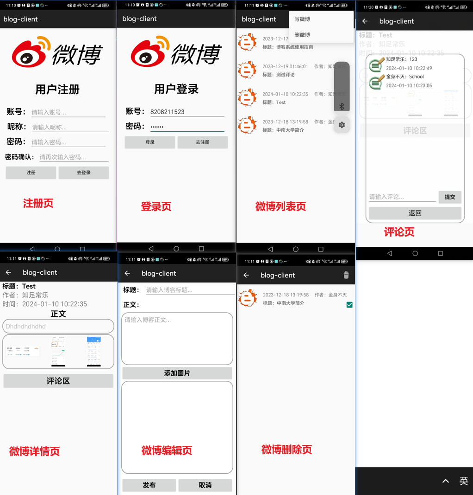

## 第一章  开发工具及环境说明

本次微博应用开发使用主要分为客户端和服务端两个开发部分，客户端开发使用**`Android Studio`**集成开发环境，使用物理机进行调试，服务端使用**`IntelliJ IDEA`**集成开发环境，服务端运行于**`Tomcat`** Web应用服务器中。

具体使用到的技术栈如下：

- **客户端**
  - Android SDK
- **服务端**
  - JDK17
  - JDBC / Druid 
  - MySQL
  - Servlet / JSP
  - Tomcat

## 第二章  微博应用业务分析

根据实验指导书要求，经过分析可罗列出微博应用主要业务：

1. **登录/注册**

   用户可以在客户端注册新用户，注册过用户后可以进行登录。只有完成登录才能进行微博的查看/评论/编写/发表等操作。这一业务会涉及到用户信息的管理，以及用户信息的校验问题，需要合理设计数据库。另外用户进行注册时，系统应当对用户填写的信息格式进行一定程度的限制，例如用户名长度，密码格式等，这有利于设计数据库。

2. **微博编写**

   用户可以编写新的微博，包括文本部分和图片部分，图片从本地图库中进行选择。这一业务中的关键是用户输入信息的收集，文本数据相对简单，图片需要特别关注。客户端应该调用本地图库供用户进行选择。

3. **微博发表/删除**

   用户可以将编辑好的微博发表，使其对其他用户可见。对于自己发表的微博，用户可以随时删除。该业务的关键是微博数据的上传和微博数据的存储。由于微博中可能包含图片，这为数据的上传增加了复杂度，需要详细了解HTTP协议的有关规定。服务端需要合理保存微博数据，这也需要认真设计数据库。

4. **微博查看**

   用户进入微博主界面后可以看到一个微博列表，用户点击一项可以查看对应微博的详情

5. **微博评论**

   用户进入一条微博的详情页后可以进行评论。评论是依附于特定微博而言的，因此服务端在存储评论时要注意保存这种关联关系。

## 第三章  微博应用系统设计

### 3.1 系统功能定义

- **登录注册功能**

- **微博展示功能**

- **微博编写功能**

- **微博删除功能**

- **微博评论功能**

### 3.2 关键问题设计

#### 3.2.1数据库设计（服务端）

数据库采用主流的关系型数据库MySQL。

首先围绕用户管理对应一个users用户表，其建表语句如下：

```mysql
CREATE TABLE IF NOT EXISTS users(
    uid VARCHAR(20) PRIMARY KEY,
    `name` VARCHAR(50) UNIQUE,
    pwd VARCHAR(20)
);
```

围绕微博对应1+n个表，其中1表示的是blog微博表，其中包含一条微博的部分信息

```mysql
CREATE TABLE IF NOT EXISTS blog(
    blogid VARCHAR(20) PRIMARY KEY,
    uid VARCHAR(20),
    content TEXT,
    picture_num INT,
    time DATETIME,
    CONSTRAINT fk_uid FOREIGN KEY(uid) REFERENCES users(uid)
);
```

注意到，表中并未包含一个微博的图片和评论两部分的数据，这两部分数据另作处理。

对于评论，由于一个微博会对应有多个用户的评论，所以理所应当地，对于有评论的微博，单独创建一个评论表。评论表的创建是在系统运行过程中动态完成的，建表语句通过JDBC传输到数据库服务器执行。评论表的建表语句如下：

```mysql
 create table %s(
    name varchar(50),
    comment text,
    time varchar(30)
)
```

对于图片，存储不使用数据库。服务端接收到一个微博地图片后将其保存至服务端特定目录中。为了建立图片数据与微博地绑定关系，存放图片的目录命名将有所要求，本实验中采用微博id来命名。

#### 3.2.2数据库连接（服务端）

数据库连接基于**`JDBC`**技术，但是考虑到性能以及为了尽可能贴近真实生产场景，本实验中还额外使用了连接池技术，通过复用数据库连接提高性能。具体地，使用阿里巴巴开发高性能**`Druid连接池`**。并单独地编写一个工具类来管理数据库连接，该类对外提供连接获取和回收方法。

```java
public class DruidManager {
    private static ThreadLocal<Connection> threadLocal =new ThreadLocal<>();
    @Getter private static DataSource dataSource;
    // 初始化连接池
    static{
        // 可以帮助我们读取.properties配置文件
        Properties properties =new Properties();
        try {
            //ClassLoader.getResourceAsStream(path)默认从ClassPath根下取文件，即classes/
            properties.load(DruidManager.class.getClassLoader().getResourceAsStream("druid.properties"));
        } catch (IOException e) {
            throw new RuntimeException(e);
        }

        try {
            dataSource = DruidDataSourceFactory.createDataSource(properties);
        } catch (Exception e) {
            throw new RuntimeException(e);
        }
    }

    /*向外提供连接的方法*/
    public static Connection getConnection(){
        Connection connection = threadLocal.get();
        if (null == connection) {
            try {
                connection = dataSource.getConnection();
            } catch (SQLException e) {
                throw new RuntimeException(e);
            }
            threadLocal.set(connection);
        }

        return connection;
    }

    /*定义一个归还连接的方法 (解除和ThreadLocal之间的关联关系) */
    public static void releaseConnection(){
        Connection connection = threadLocal.get();
        if (null != connection) {
            threadLocal.remove();
            // 把连接设置回自动提交的连接
            try {
                connection.setAutoCommit(true);
                // 自动归还到连接池
                connection.close();
            } catch (SQLException e) {
                throw new RuntimeException(e);
            }
        }
    }
}

```

#### 3.2.3数据库访问DAO层设计（服务端）

微博应用采用MVC架构设计，这里阐述数据库访问层的设计思想。

使用JDBC连接数据库后我们一般要编写方法对数据库进行CRUD操作。一般的我们需要编写两个方法：

- 一个负责查询操作，传入SQL，返回实体类对象的列表(对应数据表中的多行)
- 一个负责增删改操作，传入SQL，返回一个int值表示影响数据表中的行数

需要特殊关注查询操作。对于不同数据表，表的字段数量不同，各字段的数据类型不同，名称不同，我们需要构造的实体类对象不同，返回的对象列表类型也不同......这种种的不同就为查询方法的编写带来了麻烦，难道我们需要为每个表的查询都编写一个查询方法吗？对只有1，2个表的情况当然可以这样做，但当表的数量较多时这显然不是一个可取的做法。

我们期望只写一个高度通用的查询方法，能应对所有数据表的查询（查询一个表中的若干行）。使用泛型与反射机制可以实现这一目的！泛型机制主要用来在方法内部分析实体类对象结构，以及创建实体类对象。

```java
/**
     * 通用的数据表查询方法
     * @param clazz 实体类.class。在该方法中使用反射机制分析其结构
     * @param sql SQL语句结构
     * @param args SQL语句参数
     * @return 查询结果列表
     * @param <T> 实体类类型
     */
    protected  <T> List<T> baseQuery(Class clazz, String sql, Object ... args){
        //将要返回的实体类列表
        List<T> list =new ArrayList<>();
        //获取JDBC连接，可专门写一个类对连接进行管理
        Connection connection = DruidManager.getConnection();
        PreparedStatement preparedStatement=null;
        ResultSet resultSet =null;
        try {
            // SQL语句对象
            preparedStatement = connection.prepareStatement(sql);
            // 设置SQL语句上的参数
            for (int i = 0; i < args.length; i++) {
                preparedStatement.setObject(i+1,args[i]);
            }
            // 执行数据表查询
            resultSet = preparedStatement.executeQuery();
            //获取列信息（有多少列）
            ResultSetMetaData metaData = resultSet.getMetaData();
            int columnCount = metaData.getColumnCount();
            // 将结果集通过反射封装成实体类对象
            while (resultSet.next()) {   //while循环遍历行
                //使用反射实例化对象
                Object obj =clazz.getDeclaredConstructor().newInstance();
                for (int i = 1; i <= columnCount; i++) {   //for循环遍历列
                    //属性名
                    String columnName = metaData.getColumnLabel(i);
                    //获取属性值
                    Object value = resultSet.getObject(columnName);
                    // 处理datetime类型字段和java.util.Data转换问题
                    if(value.getClass().equals(LocalDateTime.class)){
                        value= Timestamp.valueOf((LocalDateTime) value);
                    }
                    //实体类字段名与表中属性名一一对应，通过反射获取之
                    Field field = clazz.getDeclaredField(columnName);
                    //绕开访问权限
                    field.setAccessible(true);
                    //实体类字段赋值
                    field.set(obj,value);
                }
                //加入要返回的实体类对象列表
                list.add((T)obj);
            }
        } catch (Exception e) {
            e.printStackTrace();
        } finally {
            //资源回收
            if (null !=resultSet) {
                try {
                    resultSet.close();
                } catch (SQLException e) {
                    e.printStackTrace();
                }
            }
            if (null != preparedStatement) {
                try {
                    preparedStatement.close();
                } catch (SQLException e) {
                    e.printStackTrace();
                }
            }
            DruidManager.releaseConnection();
        }
        return list;
    }
```

较为抽象的BaseDao类封装该方法，其中还有一个baseUpdate方法，比较简单就不介绍了。

这样写的BaseDao类具有高度通用性，其他具体针对某个数据表的Dao类只需简单继承BaseDao便可完成相应的数据库操作。


#### 3.2.4Servlet控制层设计（服务端）

使用Servlet类的惯用方式是，自定义一个继承HttpServlet类的类，重写父类的service方法（protected修饰的）（重写doGet/doPost也可以），方法体中编写对请求的处理逻辑。在本项目中，请求有很多种，可以分为两组（围绕用户数据的操作，围绕微博数据的操作）如果为每一组请求都创建一个Servlet类重写service方法显得太过笨拙。

我们使用反射机制进行优化：**只有一个Servlet类，只重写一次service方法**

首先编写一个通用的BaseController类

```java
public class BaseController extends HttpServlet {
    @Override
    protected void service(HttpServletRequest req, HttpServletResponse resp) throws ServletException, IOException {
        //获取请求映射路径
        String requestURI=req.getRequestURI();
        //获取请求映射路径中的统配符部分/user/*,本示例中*的值为regist,login
        //统配符部分的名称与子类中方法名对应
        String[] split=requestURI.split("/");
        String methodName=split[split.length-1];
		//使用反射机制进行方法调用
        Class clazz=this.getClass();
        try{
            Method declaredMethod=clazz.getDeclaredMethod(methodName,HttpServletRequest.class,HttpServletResponse.class);
            declaredMethod.setAccessible(true);
            declaredMethod.invoke(this,req,resp);
        }catch (Exception ex){
            ex.printStackTrace();
        }
    }
}
```

对于每一组操作都编写子类继承BaseController,这里以关于用户数据操作的子类UserController为例子来讲解思想

```java
@WebServlet("/user/*")
public class UserController extends BaseController{
    private UserService service=new UserService();
    private void login(HttpServletRequest req, HttpServletResponse resp) throws ServletException, IOException{......}
    private void register(HttpServletRequest req, HttpServletResponse resp) throws ServletException, IOException{......}
}
```

有两个关键点：

1. **BaseController子类注解中请求映射路径的写法**
2. **BaseController子类中方法的名称**

映射路径需要写为这种两级路径形式**/user/\***，并且第二级采用通配的形式。现在UserController类可以匹配以/user/开头的请求，例如/user/regist，/user/login在本示例设置的场景下，客户端对用户的注册，登录分别对应/user/regist，/user/login请求路径，这些请求都会匹配到UserController类。而UserController类是继承自BaseController类的，所以这些不同的请求都会先汇聚到BaseController类的service方法中。对于其他的BaseController子类也是这样的编写模式。


形象的讲，BaseController成为了控制层的统一入口。

总结这里的设计：**`设计的精髓在于，在BaseController的service方法中利用反射机制决定调用子类Controller中的哪个方法处理请求`**。为达到这一目的，XXXController类中方法的名字就不能乱起，必须与请求路径中的统配符的具体值一一对应。因为在BaseController中就是通过提取请求路径中的统配符值作为方法名，使用反射机制进行方法调用的。当BaseController子类很多时，BaseController类就得到了高度复用。

#### 3.2.5微博列表功能（客户端）


微博列表功能使用Android的RecyclerView+ViewHolder+Adapter套件实现。

#### 3.2.6客户端的请求发送

客户端向服务端发送的所有请求都是通过AsyncTask异步任务实现。其中的一个难点是微博数据的上传，由于微博数据包含文本和图片两类格式必须使用POST请求，需要特别设置报文的有关字段，并且由于本实验中使用原生Android SDK，所以还需要手动设置一些报文成分，例如分隔符。图片上传的有关代码如下：

```java
protected String doInBackground(String... jsons) {
            String json = jsons[0];
            Log.i("json字符串：", json);
            try {
                String boundary = "*****" + Long.toString(System.currentTimeMillis()) + "*****";
                URL url = new URL(URLPattern.PUBLISH_URL);
                HttpURLConnection connection = (HttpURLConnection) url.openConnection();
                // 设置请求头参数
                connection.setDoInput(true);
                connection.setDoOutput(true);
                connection.setRequestMethod("POST");
                connection.setRequestProperty("Connection", "Keep-Alive");
                connection.setRequestProperty("Content-Type", "multipart/form-data; charset=utf-8; boundary=" + boundary);
                DataOutputStream outputStream = new DataOutputStream(connection.getOutputStream());
                // 写入JSON字符串
                outputStream.writeBytes("--" + boundary + "\r\n");
                outputStream.writeBytes("Content-Disposition: form-data; name=\"json_data\"\r\n");
                outputStream.writeBytes("Content-Type: application/json; charset=utf-8\r\n\r\n");
                outputStream.write(json.getBytes(StandardCharsets.UTF_8)); // 转换为UTF-8字节流
                outputStream.writeBytes("\r\n");
            // 写入图片
                if(mAdapter!=null){
                    for (Uri pictureUri : mAdapter.pictures) {
                        outputStream.writeBytes("--" + boundary + "\r\n");
                        outputStream.writeBytes("Content-Disposition: form-data; name=\"picture\";filename=\"" + pictureUri.getLastPathSegment() + "\"\r\n");
                        outputStream.writeBytes("Content-Type: image/jpeg\r\n\r\n");

                        InputStream inputStream = getContentResolver().openInputStream(pictureUri);
                        byte[] buffer = new byte[4096];
                        int bytesRead;
                        while ((bytesRead = inputStream.read(buffer)) != -1) {
                            outputStream.write(buffer, 0, bytesRead);
                        }
                        inputStream.close();
                        outputStream.writeBytes("\r\n");
                    }
                }
                outputStream.writeBytes("--" + boundary + "--\r\n");
                outputStream.flush();
                outputStream.close();
                // 获取响应
                InputStream responseStream = new BufferedInputStream(connection.getInputStream());
                BufferedReader responseStreamReader = new BufferedReader(new InputStreamReader(responseStream));
                String line;
                StringBuilder stringBuilder = new StringBuilder();
                while ((line = responseStreamReader.readLine()) != null) {
                    stringBuilder.append(line);
                }
                responseStreamReader.close();
                String response = stringBuilder.toString();
                responseStream.close();
                connection.disconnect();
                return response;
            }catch (Exception ex){
                ex.printStackTrace();
            }
            return null;
        }
```

## 第四章  微博应用源代码清单

### 4.1客户端

- **async包**

| 文件               | 描述                              |
| ------------------ | --------------------------------- |
| BaseAsyncTask.java | 较为通用的异步任务（发送Get请求） |
| URLPattern.java    | 存放一些URL模板                   |

- **com.example.blog_clientb包**

| 文件                     | 描述                                                         |
| ------------------------ | ------------------------------------------------------------ |
| FragmentActivity.java    | 通用的托管Fragment的Activity                                 |
| IndexActivity.java       | 应用初始登录/注册界面，它会托管两个Fragment分别用于登录注册  |
| FromFragment.java        | LoginFragmnet,RegisterFragment的公共父类，包含两个页面的通用组件 |
| LoginFragment.java       | 登录界面Fragment                                             |
| RegisterFragment.java    | 注册界面Fragment                                             |
| BlogListActivity.java    | 托管列表页Fragment的Activity                                 |
| BlogListFragment.java    | 登录成功后的界面，显示微博列表（RecyclerView）               |
| BlogDetailActivity.java  | 点击微博列表中的一项后进入的详情页，显示一条微博的详细信息   |
| EditBlogActivity.java    | 新微博编辑页面                                               |
| BlogDelListActivity.java | 微博删除页面，显示当前用户发表的所有微博，供用户进行删除。<br />也是一个RecyclerView列表 |

- **entity包**

| 文件              | 描述                                           |
| ----------------- | ---------------------------------------------- |
| Blog.java         | 对应一条微博的详细信息，包含一条微博应有的属性 |
| BlogListItem.java | 对应微博列表中一项的信息，包含列表项所需的属性 |
| Comment.java      | 对应一条评论                                   |

- **res/layout/**

  若干XML布局文件

### 4.2服务端

- **dao包**

| 文件         | 描述                               |
| ------------ | ---------------------------------- |
| BaseDao.java | 封装通用数据库访问方法             |
| BlogDao.java | 封装与微博数据相关的数据库访问方法 |
| UserDao.java | 封装与用户数据相关的数据库访问方法 |

- **service包**

| 文件             | 描述                         |
| ---------------- | ---------------------------- |
| BlogService.java | 实现与微博相关的业务逻辑     |
| UserService.java | 实现与用户登录相关的业务逻辑 |

- **controller包**

| 文件                | 描述                                                         |
| ------------------- | ------------------------------------------------------------ |
| BaseController.java | 通用的Servlet类，后端统一入口                                |
| BlogController.java | 接收客户端与微博相关的请求，并调用服务层方法处理。继承BaseController |
| UserController.java | 接收客户端与用户相关的请求，并调用服务层方法处理。继承BaseController |

- **entity包**

| 文件            | 描述           |
| --------------- | -------------- |
| Blog.java       | ......         |
| BlogDetail.java | 微博详情实体类 |
| BlogItem.java   | 微博项实体类   |
| Comment.java    | 评论实体类     |
| User.java       | 用户实体类     |

- **util包**

| 文件              | 描述                                               |
| ----------------- | -------------------------------------------------- |
| DruidManager.java | 封装Druid连接池，对外提供获取连接/回收连接方法     |
| SQL.java          | 封装一些SQL语句模板                                |
| WebUtil.java      | 封装一些常用Web操作，例如json/对象转换，图片上传等 |

## 第五章  微博应用运行结果与测试分析



## 第六章  结论与心得

本次实验综合使用了本学期《移动应用开发》，《Web技术》课程所学知识，较为完整的完成了一个客户端/服务器应用。通过本次实验，我对于MVC软件架构，边界的切分有了更深入的理解。在本次实验中我通过Java反射和泛型技术对代码进行了结构优化，充分考虑了代码的复用性和可扩展性，这些点让我收获很多。另外本实验中的图片+文本数据的上传是一个难点（使用原生Android SDK）,需要详细了解HTTP报文的结构，并手动设置相关字段。这一过程中让我对HTTP协议有了进一步的认识。

本次实验做的比较匆忙，较为粗糙，这是需要反思的地方。